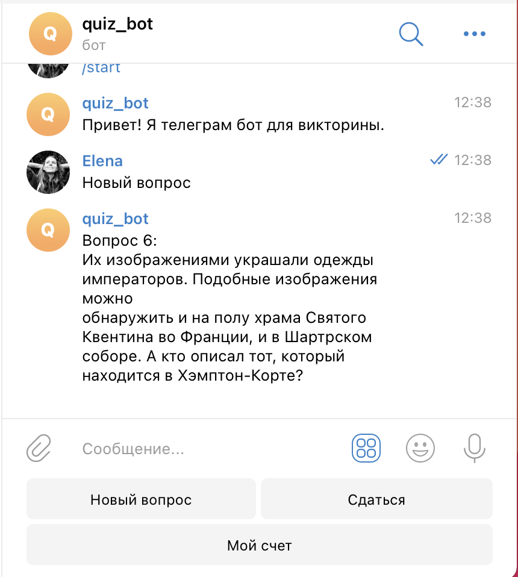
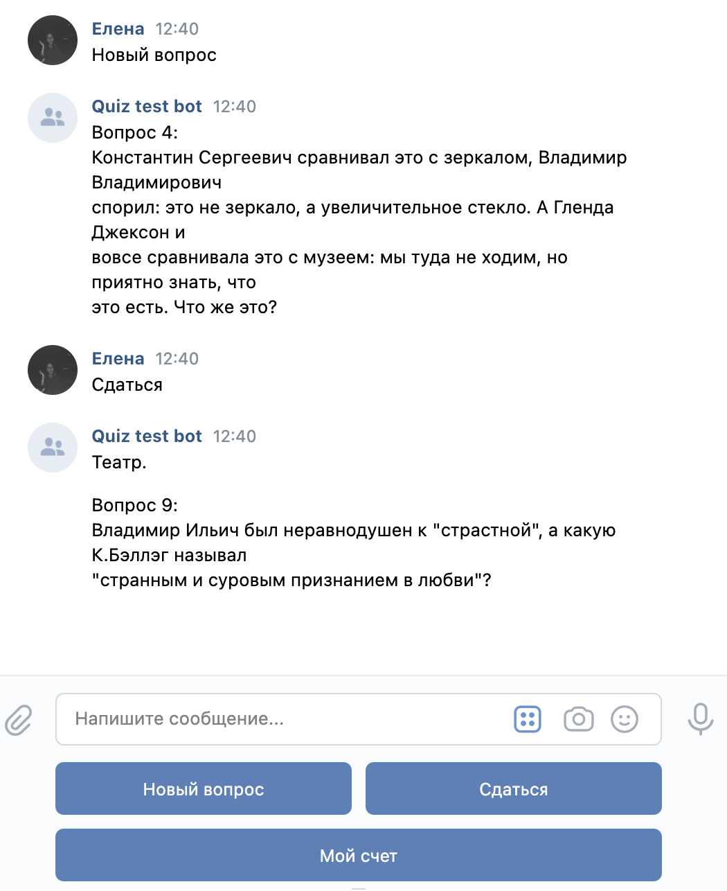

# Quiz бот

Проект предназначен проведения викторины через телеграм и вк бота.
Примеры реализованных ботов:
- `@quiz_dvmn_bot`
- [https://vk.com/public208565670](https://vk.com/public208565670)


<br>


### Как установить

Создайте файл `.env` со следующими переменными:

- `BOT_TOKEN` — токен телеграм бота службы поддержки.
- `REDIS_HOST` — хост от базы данных Redis.
- `REDIS_PORT` — порт от базы данных Redis.
- `REDIS_PASSWORD` — пароль от базы данных Redis.
- `VK_TOKEN` — ключ для общения бота через VK.


Python3 должен быть уже установлен. 
Затем используйте `pip` (или `pip3`, если есть конфликт с Python2) для установки зависимостей:
```
pip install -r requirements.txt
```

Чтобы запустить бота, необходимо выполнить команду:
```
python3 tg_bot.py
```
или
```
python3 vk_bot.py
```

### Цель проекта

Код написан в образовательных целях на онлайн-курсе для веб-разработчиков [dvmn.org](https://dvmn.org/).